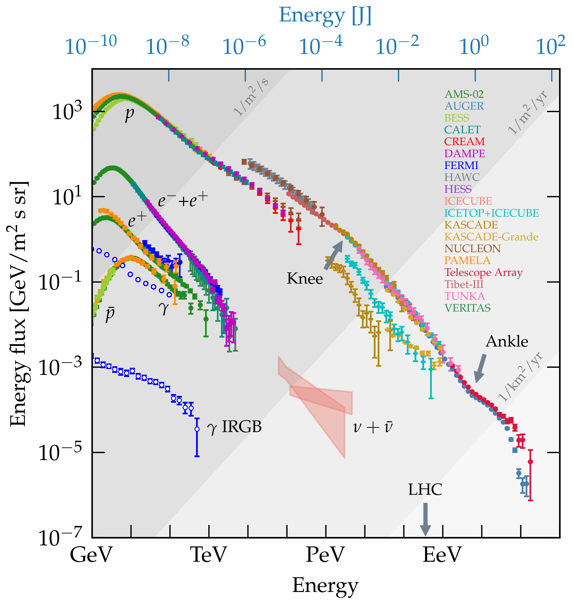

# The Cosmic Ray Spectrum (2020)

Please email me [carmelo.evoli@gssi.it] or make a pull request if you would like any dataset being added.

### 
### Spectrum plot

Download: [png](https://github.com/carmeloevoli/The_CR_Spectrum/blob/master/plots/The_CR_Spectrum_2020.png), [pdf](https://github.com/carmeloevoli/The_CR_Spectrum/blob/master/plots/The_CR_Spectrum_2020.pdf)

### Data

#### All particles
* AUGER: [data](https://github.com/carmeloevoli/The_CR_Spectrum/blob/master/data/allparticle/allparticle_AUGER_E_2019.txt), [reference](https://ui.adsabs.harvard.edu/abs/2019ICRC...36..450V)
* HAWC: [data](https://github.com/carmeloevoli/The_CR_Spectrum/blob/master/data/allparticle/allparticle_HAWC_E_2017.txt), [reference](https://journals.aps.org/prd/abstract/10.1103/PhysRevD.96.122001)
* ICETOP+ICECUBE: [data](https://github.com/carmeloevoli/The_CR_Spectrum/blob/master/data/allparticle/allparticle_ICETOP%2BICECUBE_E_2019.txt), [reference](https://doi.org/10.1103/PhysRevD.100.082002)
* TIBET: [data](https://github.com/carmeloevoli/The_CR_Spectrum/blob/master/data/allparticle/allparticle_TIBET_E_2008.txt), [reference](https://iopscience.iop.org/article/10.1086/529514)

#### Protons
* AMS02: [data](https://github.com/carmeloevoli/The_CR_Spectrum/blob/master/data/protons/H_AMS02_E_2019.txt), [reference](https://journals.aps.org/prl/abstract/10.1103/PhysRevLett.114.171103)
* BESS: [data](https://github.com/carmeloevoli/The_CR_Spectrum/blob/master/data/protons/H_BESS_kenergy.txt), [reference](https://ui.adsabs.harvard.edu/abs/2007APh....28..154S)
* CALET: [data](https://github.com/carmeloevoli/The_CR_Spectrum/blob/master/data/protons/H_CALET_kenergy.txt), [reference](https://ui.adsabs.harvard.edu/abs/2019PhRvL.122r1102A)
* CREAM: [data](https://github.com/carmeloevoli/The_CR_Spectrum/blob/master/data/protons/H_CREAM_kenergy.txt), [reference](https://ui.adsabs.harvard.edu/abs/2017ApJ...839....5Y)
* DAMPE: [data](https://github.com/carmeloevoli/The_CR_Spectrum/blob/master/data/protons/H_DAMPE_kenergy.txt), [reference](https://ui.adsabs.harvard.edu/abs/2019SciA....5.3793A)

#### Leptons
* AMS02: [data](https://github.com/carmeloevoli/The_CR_Spectrum/blob/master/data/leptons/leptons_AMS02_kenergy.txt), [reference](https://ui.adsabs.harvard.edu/abs/2019PhRvL.122j1101A)
* CALET: [data](https://github.com/carmeloevoli/The_CR_Spectrum/blob/master/data/leptons/leptons_CALET_kenergy.txt), [reference](https://ui.adsabs.harvard.edu/abs/2018PhRvL.120z1102A)
* DAMPE: [data](https://github.com/carmeloevoli/The_CR_Spectrum/blob/master/data/leptons/leptons_DAMPE_kenergy.txt), [reference](https://ui.adsabs.harvard.edu/abs/2017Natur.552...63D)
* FERMI: [data](https://github.com/carmeloevoli/The_CR_Spectrum/blob/master/data/leptons/leptons_FERMI_kenergy.txt), [reference](https://ui.adsabs.harvard.edu/abs/2017PhRvD..95h2007A)
* VERITAS: [data](https://github.com/carmeloevoli/The_CR_Spectrum/blob/master/data/leptons/leptons_VERITAS_kenergy.txt), [reference](https://ui.adsabs.harvard.edu/abs/2018PhRvD..98f2004A)

#### Anti-protons
* AMS02: [data](https://github.com/carmeloevoli/The_CR_Spectrum/blob/master/data/antiprotons/Hbar_AMS02_kenergy.txt), [reference](https://ui.adsabs.harvard.edu/abs/2016PhRvL.117i1103A)
* BESS: [data](https://github.com/carmeloevoli/The_CR_Spectrum/blob/master/data/antiprotons/Hbar_BESS_kenergy.txt), [reference](https://ui.adsabs.harvard.edu/abs/2012PhRvL.108e1102A)
* PAMELA: [data](https://github.com/carmeloevoli/The_CR_Spectrum/blob/master/data/antiprotons/Hbar_PAMELA_kenergy.txt), [reference](https://ui.adsabs.harvard.edu/abs/2013JETPL..96..621A)

#### Positrons
* AMS02: [data](https://github.com/carmeloevoli/The_CR_Spectrum/blob/master/data/positrons/positrons_AMS02_kenergy.txt), [reference](https://ui.adsabs.harvard.edu/abs/2019PhRvL.122d1102A)
* PAMELA: [data](https://github.com/carmeloevoli/The_CR_Spectrum/blob/master/data/positrons/positrons_PAMELA_kenergy.txt), [reference](https://github.com/carmeloevoli/The_CR_Spectrum/blob/master/data/positrons/positrons_PAMELA_kenergy.txt)
* FERMI: [data](https://github.com/carmeloevoli/The_CR_Spectrum/blob/master/data/positrons/positrons_FERMI_kenergy.txt), [reference](https://ui.adsabs.harvard.edu/abs/2012PhRvL.108a1103A)

