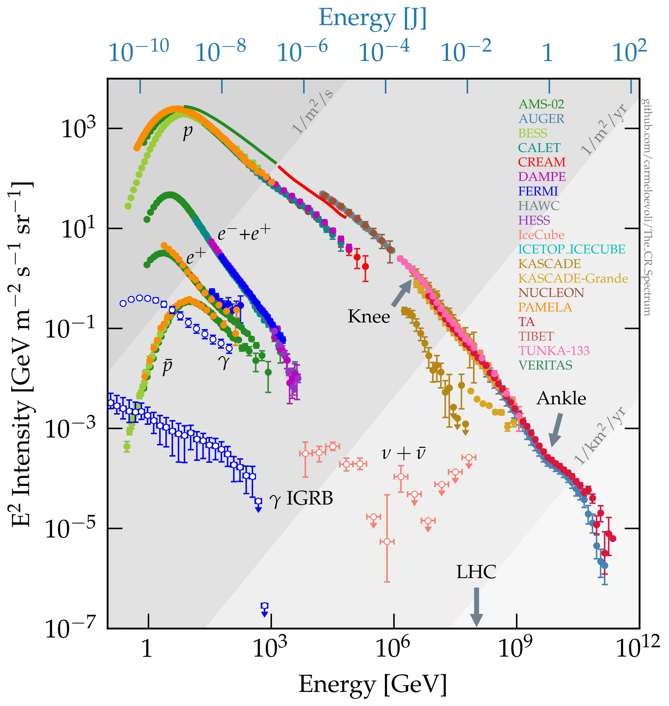

[](https://opensource.org/licenses/mit-license.php)
[](https://doi.org/10.5281/zenodo.1468852)

## The Cosmic Ray Spectrum (v24.10)

Please email me [carmelo.evoli@gssi.it] or make a pull request if you would like any dataset being added.

For the collection of the CR data I'm pleased to acknowledge the use of the [CRDB database v4.1](http://lpsc.in2p3.fr/crdb) ([reference]([https://ui.adsabs.harvard.edu/abs/2014A&A...569A..32M](https://ui.adsabs.harvard.edu/abs/2023EPJC...83..971M/abstract)))

### <a name="crspectrum"></a>
### The Spectrum plot



Download: [png](https://github.com/carmeloevoli/The_CR_Spectrum/blob/master/figures/The_CR_Spectrum_2024.png), [pdf](https://github.com/carmeloevoli/The_CR_Spectrum/blob/master/figures/The_CR_Spectrum_2024.pdf)

### How to cite it

```
@misc{The_CR_spectrum,
  author       = {Evoli, Carmelo},
  title        = {The Cosmic-Ray Energy Spectrum},
  month        = dec,
  year         = 2020,
  publisher    = {Zenodo},
  doi          = {10.5281/zenodo.4396125},
  url          = {https://doi.org/10.5281/zenodo.4396125}
}
```
